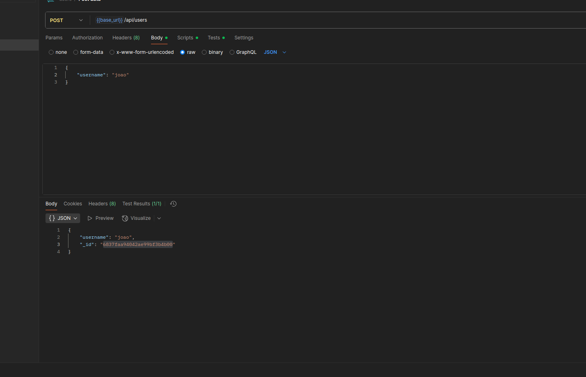
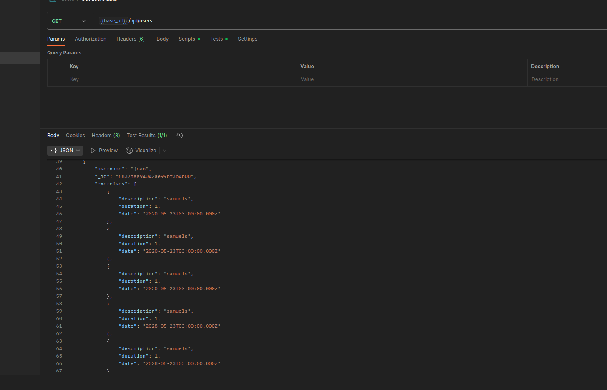
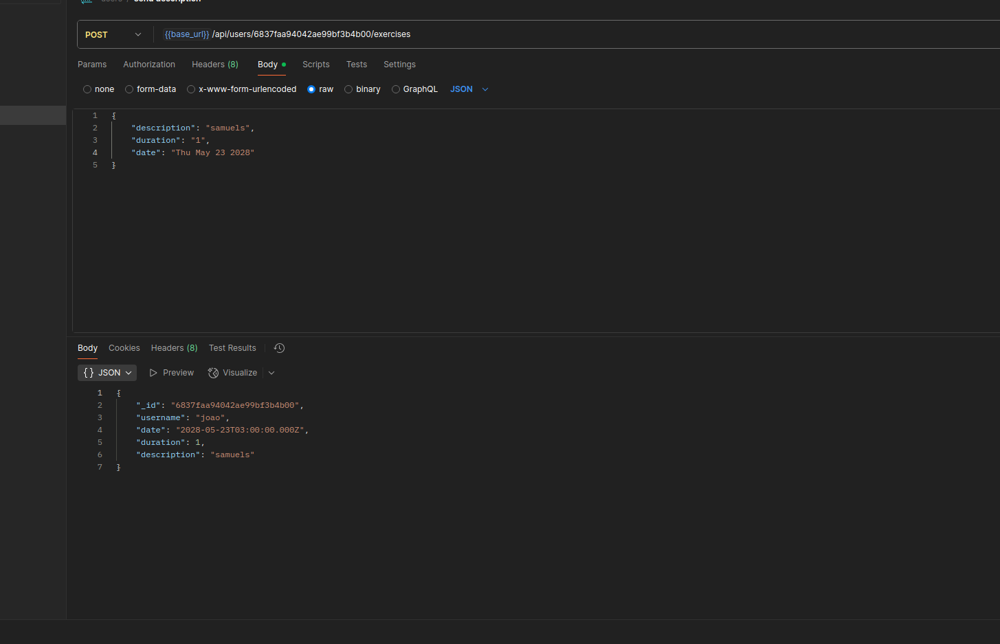
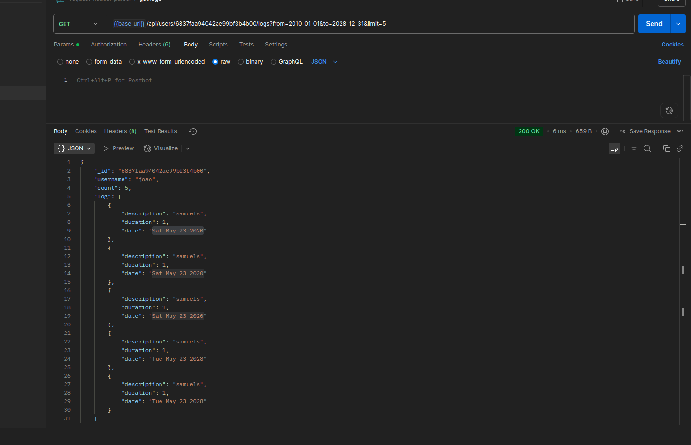

# Exercise Tracker API

This is a simple RESTful API built with Node.js and Express that allows you to create users, add exercises for each user, and retrieve exercise logs with optional filtering.

---

## 📚 API Endpoints

| Method | Endpoint                      | Description                                         |
|--------|-------------------------------|-----------------------------------------------------|
| POST   | `/api/users`                  | Create a new user with a unique ID                   |
| GET    | `/api/users`                  | Get an array of all users                            |
| POST   | `/api/users/:_id/exercises`  | Add an exercise entry for a user specified by `_id` |
| GET    | `/api/users/:_id/logs`       | Get exercise log of a user with optional filters     |

---

## Detailed Route Descriptions

### 1. Create a new user

- **Endpoint:** `POST /api/users`  
- **Description:** Creates a new user with a unique ID.  
- **Request Body (x-www-form-urlencoded or JSON):**

```
{
"username": "your_username"
}
```

- RESPONSE
```
{
"username": "your_username",
"_id": "unique_user_id"
}
```
- CURL
```
curl --location 'http://localhost:3000/api/users' \
--header 'Content-Type: application/json' \
--data '{
	"username": "samuel r"
}'
```


### 2. Get all users

- **Endpoint:** `GET /api/users`  
- **Description:** Retrieves an array of all users.  
- RESPONSE
```
[{
"username": "user1",
"_id": "id1"
},
{
"username": "user2",
"_id": "id2"
}]
```

- CURL
```
curl --location 'http://localhost:3000/api/users'
```


### 3. Add an exercise to a user

- **Endpoint:** `POST /api/users/:_id/exercises`  
- **Description:** Adds an exercise entry for a user specified by `_id`.  
- **Parameters:**  
- `:_id` - User's unique ID (URL parameter)  
- **Request Body (x-www-form-urlencoded or JSON):**

- CURL
```
curl --location 'http://localhost:3000/api/users/6837f6ea4042ae99bf3b4afe/exercises' \
--header 'Content-Type: application/json' \
--data '{
	"description": "samuels",
    "duration": "1",
	"date": ""
}
```


### 4. Get exercise log of a user

- **Endpoint:** `GET /api/users/:_id/logs`  
- **Description:** Retrieves the exercise log for a user with optional filters.  
- **Parameters:**  
- `:_id` - User's unique ID (URL parameter)  
- Query parameters (optional):  
  - `from` - Start date (inclusive) in `yyyy-mm-dd` format  
  - `to` - End date (inclusive) in `yyyy-mm-dd` format  
  - `limit` - Maximum number of log entries to return (integer)  

```
curl --location 'http://localhost:3000/api/users/6837faa94042ae99bf3b4b00/logs?from=2010-01-01&to=2028-12-31&limit=5' \
--data ''
```



## Running the Project

1. **Install dependencies:**

- yarn install

2. **Start the server:**

- yarn start

Exercise Tracker API! 🚀
